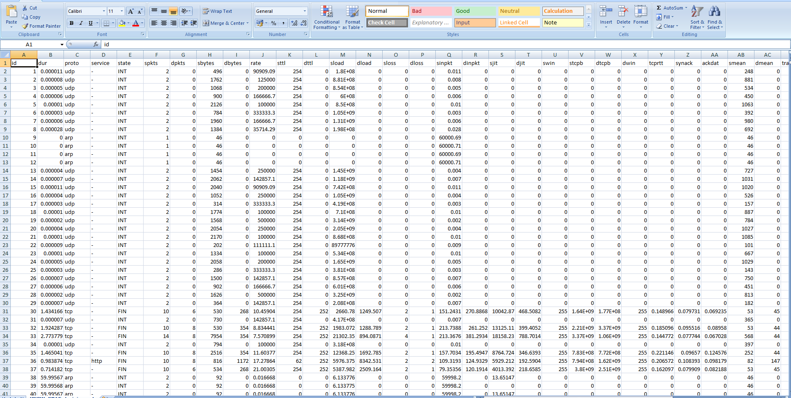
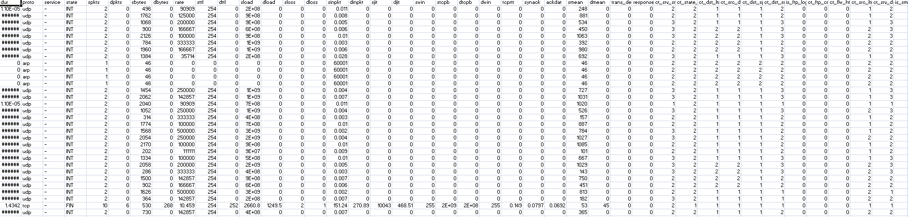
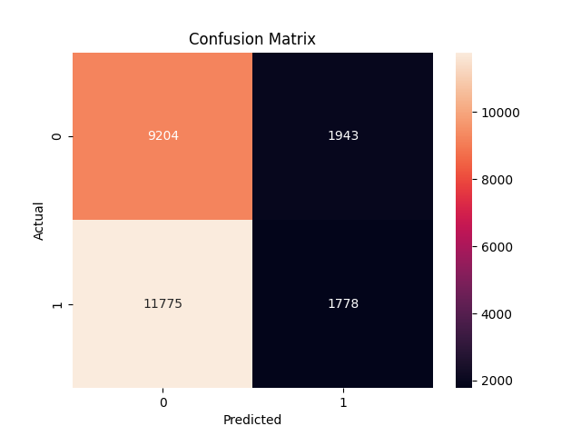
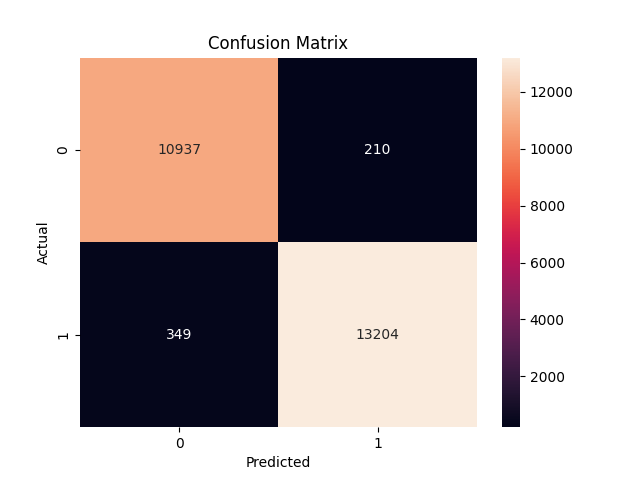
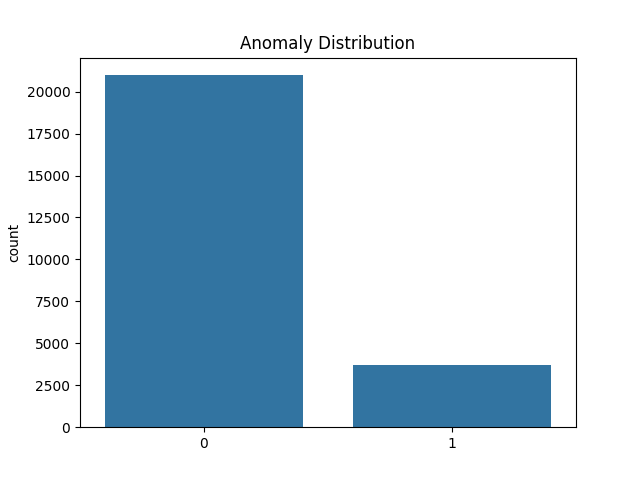
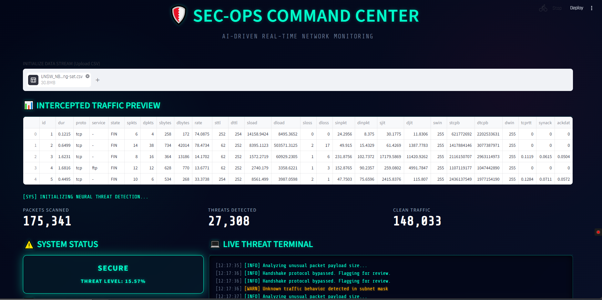
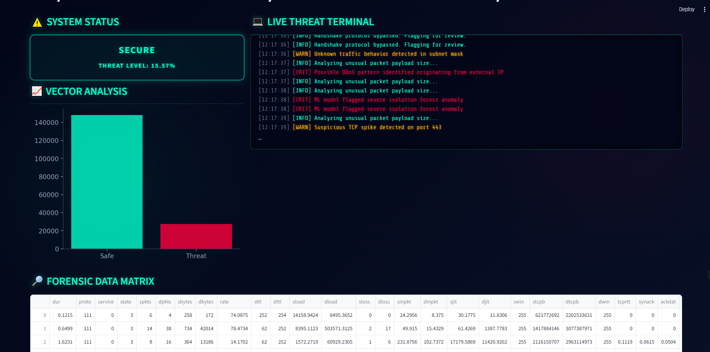

# 🛡️ AI-Powered Cybersecurity Threat Detection System

## 🚀 Overview
An AI-based system to detect cyber threats in network traffic using machine learning and anomaly detection.

---

## 🎯 Problem Statement
Traditional systems fail to detect unknown threats. This project uses AI to identify anomalies and suspicious patterns.

---

## 🌍 Industry Relevance
Used in:
- SOC teams
- Banks
- Cloud security
- Network monitoring systems

---

## 🛠️ Tech Stack
- Python
- Pandas, NumPy
- Scikit-learn
- Streamlit
- Matplotlib

---

## 🧠 Models Used
- Isolation Forest
- Random Forest

---

## 🏗️ Architecture
Data → Preprocessing → Feature Engineering → Model → Dashboard

---

## 📊 Dataset
- UNSW-NB15 dataset

---

## ⚙️ Installation

```bash
pip install -r requirements.txt

**▶️ How to Run**

**Train:**
python main.py

**Run Dashboard:**
streamlit run dashboard/app.py

**## 📈 Results**
Random Forest Accuracy: ~98%
Real-time anomaly detection

**🖥️ Dashboard Preview**

**💻 Features**
Real-time detection
SOC dashboard
Live logs
Risk indicator

**🎓 Learning Outcomes**
End-to-end ML pipeline
Real-world error handling
Deployment thinking

**📌 Future Improvements**
Real-time streaming
API deployment

**👨‍💻 Author**
Aniket
---

---

## 🗓️ Day 1 – Setup
- Folder structure
- requirements.txt  
**Commit:**
```bash
Initial project setup and structure

🗓️ Day 2 – Dataset
Load dataset
Show preview
Commit:
Added dataset loading and exploration

🗓️ Day 3 – Preprocessing
Cleaning + encoding
Commit:
Implemented data preprocessing pipeline

🗓️ Day 4 – Model
Train models
Commit:
Implemented Isolation Forest and Random Forest models

🗓️ Day 5 – Evaluation
Metrics + confusion matrix
Commit:
Added model evaluation metrics and visualization

🗓️ Day 6 – Visualization
Graphs
Commit:
Added data visualization and analysis graphs

🗓️ Day 7 – Dashboard
Streamlit UI
Commit:
Built SOC-style Streamlit dashboard with real-time detection

**#PROOF CHECKLIST**

### 1. Dataset Preview


---

### 2. Preprocessing Output


---

### 3. Confusion Matrix (Random Forest)


---

### 4. Confusion Matrix (Isolation Forest)


---

### 5. Detection Graph


---

### 6. Dashboard UI


---

### 7. Live Logs / SOC Feed


---

### 🎥 Demo Video

👉 [Watch Dashboard Demo](images/dashboard_demo.mp4)

👉 SOC feed
